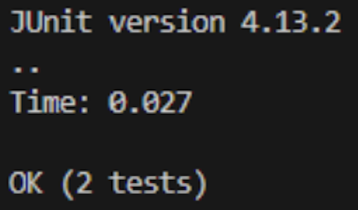

# Lab Report 4

## Performing Lab Tasks

1. First, we delete any of the existing forks of the repository in the account.

2. Next, we fork the repository.

3. Then, start the timer for the task.

4. **GOOO!** Log into your ieng6. As shown below the following commands were used.
`<enter>` `<tab>` `<esc>`

5. You will then clone your fork of the repository from the Github account

6. Next, run the tests, as they are to demonstrate that they failed.

7. Then, you will edit the code file to fix the failing test

8. After, run the tests, demonstrating that they now succeed                                                  

9. Finally, using commit and push it will result in the change to the Github account

