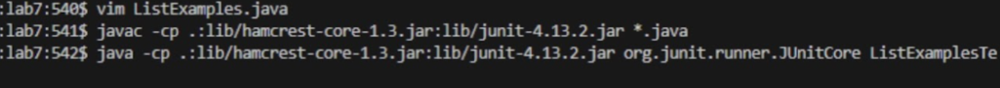

# Lab Report 4

## Performing Lab Tasks

1. First, we delete any of the existing forks of the repository in the account.

2. Next, we fork the repository.

3. Then, start the timer for the task.

4. **GOOO!** Log into your ieng6. As shown below the following commands were used.
- open bash terminal then type into the command line `ssh cs15lsp23av@ieng6.ucsd.edu` then press <enter>
- type password into new line propted then press `<enter>`


5. You will then clone your fork of the repository from the Github account
- in terminal type `git clone https://github.com/ucsd-cse15l-s23/lab7` then press `<enter>`


6. Next, run the tests, as they are to demonstrate that they failed.
- in terminal type `ls` then press `<enter>`
- type in terminal show below
```
local $ javac -cp .:lib/hamcrest-core-1.3.jar:lib/junit-4.13.2.jar *.java
local $ java -cp .:lib/hamcrest-core-1.3.jar:lib/junit-4.13.2.jar org.junit.runner.JUnitCore ArrayTests
```
then press `<enter>`


7. Then, you will edit the code file to fix the failing test. The following commands were used in this order to fix the code. can find each word quickly by searching for a specfic word or using you `J K L H` keys on computer.

`42 j` (moves 42 lines down) → `11 l`(move 11 lines to the right) → `x i 2` (in normal mode x deletes character then i to insert value of 2) → `<esc>` (make sure you are in normal mode) → `:wq` (save changes and exit)
type in terminal `vim ListExamples.java` then go to `index1 +=1;` (edits will begin here) → `llllll i` (move to the right 6 time then insert using i) → `<bs>` (type <bs>) → `2` (type the value 2) → `<esc>` (make sure you are in normal mode) → `:wq` (save changes and exit)


8. After, run the tests, demonstrating that they now succeed                         
- type in terminal
```
vim ListExamples.java
local $ javac -cp .:lib/hamcrest-core-1.3.jar:lib/junit-4.13.2.jar *.java
local $ java -cp .:lib/hamcrest-core-1.3.jar:lib/junit-4.13.2.jar org.junit.runner.JUnitCore ArrayTests
```



9. Finally, using commit and push it will result in the change to the Github account.                                   
(was having issues with this during lab and also after lab)
(am still unable to do git commit and push using SSH and HTTPS)
(reverted my Lab report 4 from SSH to HTTPS back to SSH)
(Could not go office hours as i have class and my work job during those times)


