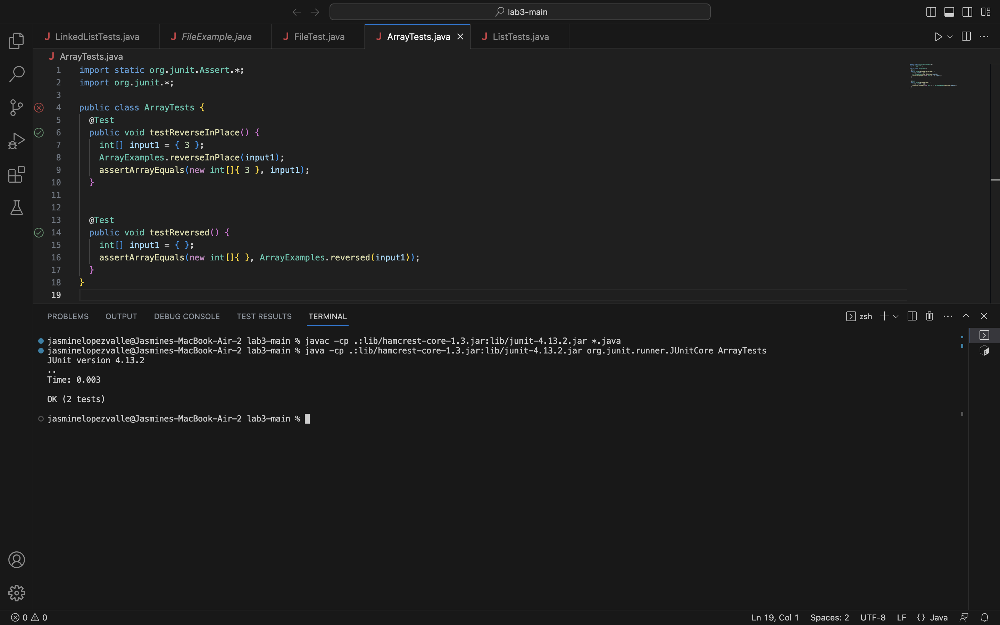

# Lab Report 5

## Part 1 : Debugging Scenario post on EdStem with student

-----------------------------------------------------------------------------------------------------------------
 
```
Hello TA! I am having this error in my code and not sure how to fix it? 
I think it could have something to do with what i am writing in my terminal
but im certain that i am typing everything correclty, i think? I was hoping
if you can help me with this issue? I have provided the scrrenshots of 
my code, java file and bash script in my EdStem post, thank you!
```
-----------------------------------------------------------------------------------------------------------------

```
Thank you submitting your question about your code. After looking at the 
screenshots you have provided look at your javac command in your temrinal
carefully? Check that you are compiling the correct file and look at the
type of file it is. You may have been typing it correctly but adding 
unneeded information could be the reason why it not able to compile properly. 
Also make sure you are in the correct terminal whether you think it is bash 
or not. If you have anymore questions please come back to this post :)
```
-----------------------------------------------------------------------------------------------------------------

 
```
Hi TA. I tried going over carefully in what i wrte in my terminal, i checked
to see if i was compiling the correct file. It turns out i was using the 
correct file but kept typing it as ArrayTest.class or ArrayTest.java. I tried
removing the ending part by leaving it as ArrayTest and it finally worked. I 
also noticed i had a misspelling error in my javac command so after i fixed 
those errors everthing worked now! Since i type fast I had thought i had typed
everything correctly but i know relized that most of my mistakes are from 
misspelling. Thank you TA!
```
-----------------------------------------------------------------------------------------------------------------

File & Directory Structure
    
    
    
Before Fixing : Contents of each File 
    
    
Full Command lines to trigger bug
    
    
Description : edit that fixed the bug
    
    Made sure spelling error was corrected from `JunitCore` to `JUnitCore`. Also not using `.class` or `.java` after ArrayTest within the javac command.
    

## Part 2 : Reflection and Thoughts

* WOW, this quarter went by SO FAST! I could not imagine being able to learn the many different techniques and skills a few years back when dieting to be a computer science major. One topic that we addressed and I found to be really cool during our labs is building our very own web server. Building a server is something I have seen in movies and never would have imagined to be doing on my own one day with my partner. My partner and I helped each other to understand what we were doing and then tried it on our own. I felt really cool and "techy", just like Peneople Garcia from Criminal Minds lol. I even went back home during the memorial holiday and showed my family what I could do and they were impressed. This will stick with me even though some may think it's simple. I thought it was cool!!!

`Sorry I worte a lot, I wanted to keep writting :)`
