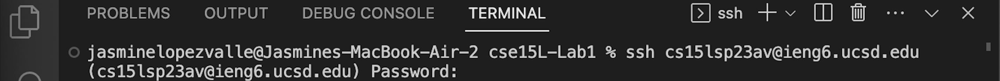
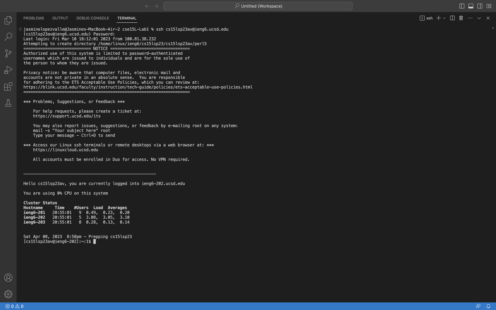
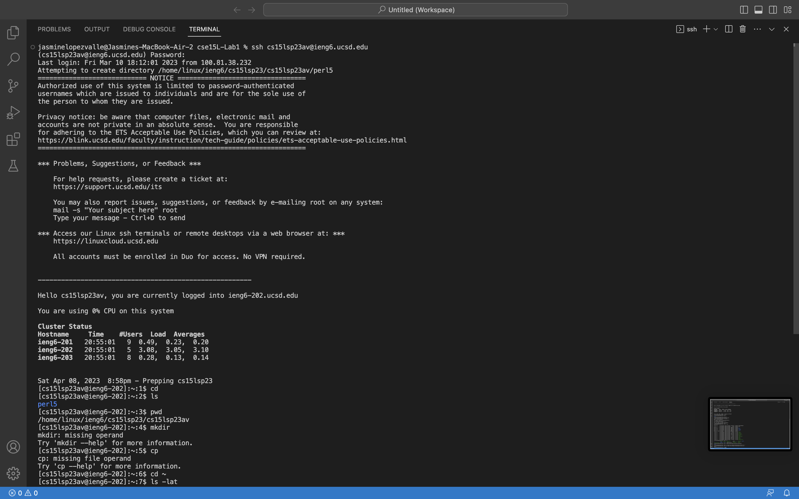

# Lab Report 1

## Welcome to CSE15L

Congratulations on starting your journey in CSE15L! In this tutorial we are going to be helping you set up your workstations. What do I mean by workstations? Well… this is getting your ieng6 account up and running, installing Visual Studio (coding program), remotely connecting using Visual Studio, and lastly trying out some commands. This might feel like A LOT but do not worry! This blog post will go step-by-step with pictures to help guide you in this process. 

Now let's get started with setting up your ieng6 account first!

## Setting up your ieng6 account

1. Click the link and it will direct you to UCSD Account Lookup
[https://sdacs.ucsd.edu/~icc/index.php](https://sdacs.ucsd.edu/~icc/index.php)

2. Now you will need to input your UCSD username and PID (see image below)


3. Click the Submit button and it should direct you to a new page with your course specifc account name. Make sure you input the correct information!


4. Select the account that starts with cs15l keep in mind that everyones account is differnt. Just make sure that it starts with cs15l. Then click on "Global Password Change Tool"


5. Then click on "Proceed to Password change tool"


6. Once you click the account name you need to change your password for that specific account. **NOT YOU UCSD ACCOUNT ONLY THE CS15L ACCOUNT**


7. Here you will type your cs15l username.


8. Click the link that is boxed in red.


9. **PAY CLOSE ATTENTION TO THIS STEP** Enter your current passwrod then followed by your new password. For "Change my TritonLink password" select NO and for "Change course specific account passwords" select YES. Then click Change Password.


10. Once you reach the end (see image below) you **MUST** wait 15 minutes for your account to come into affect. When the time is up you will using Visual Studio to test your account.


## Installing Visual Studio

1. Click the link and it will direct you Visual Studio (Make sure to click either macOS or Windows)
[https://code.visualstudio.com/docs/setup/mac](https://code.visualstudio.com/docs/setup/mac)

2. Please follow the proper directions for your specific device on installing Visual Studio (see image below)


3. To know that you successfully installed Visual Studio look at the image below


4. Now move on to the next step with Remotely Connecting!


## Remotely Connecting

1. Open Visual Studio and open a new terminal (see image below)


2. In the terminal type your cs15l username but replace the zz with your specific username informmation.
```
$ ssh cs15lsp23zz@ieng6.ucsd.edu
```

4. A new line will pop-up with your user followed by your Password (see image below)


5. **WARNING** the password you use is the password you change in the beginning of this tutorial. Also when you are trying to type in your password in the terminal **IT WILL NOT APPEAR**. This is for security purposes, if you type it incorrectly press enter for the password line to appear again. 

6. When you press enter/return on your keyboard your terminal should look like the image below. Now you have successfully completed remote connecting! Let's try some commands to have more practice



## Now let's try some commands

1. Now let's try running some commands! Below are some commands that you can try out
  * `cd`
  * `ls`
  * `pwd`
  * `mkdir`
  * `cp`
  * `cd ~`
  * `ls -lat`
  * `ls -a`
  * `ls <directory>` replace `<directory>` with `/home/linux/ieng6/cs15lsp23/cs15lsp23abc` make sure to also replace `abc` with a proper username
  * `cp /home/linux/ieng6/cs15lsp23/public/hello.txt ~/`
  * `cat /home/linux/ieng6/cs15lsp23/public/hello.txt`

2, Down below are a few descpriptions of some of the commands and what they do.
  * `ls -la` : lists all the files and directories in the current working directory or a directory that the user specifies.
  * `ls -l` : option uses a long listing format which adds information about the permissions, size, last modified, etc. associated with the file or directory.
  * `ls -a` : lists directories starting with ',' (the hidden directories).

For more detailed information abuot commands you cantry the command `ls -help` or `main ls` or check out the linux main pages online by clicking this link. 
[https://man7.org/linux/man-pages/man1/ls.1.html](https://man7.org/linux/man-pages/man1/ls.1.html)

3. In the image below are examples on how using certain commands will look like in the terminal.
 


## CONGRATULATION YOU FINISHED THIS TUTORIAL!

