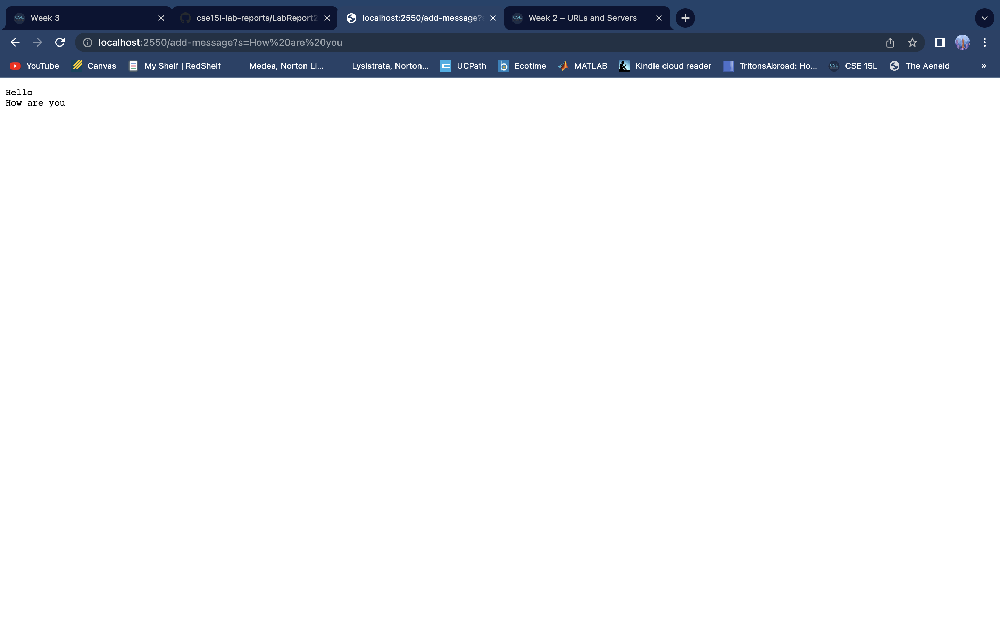
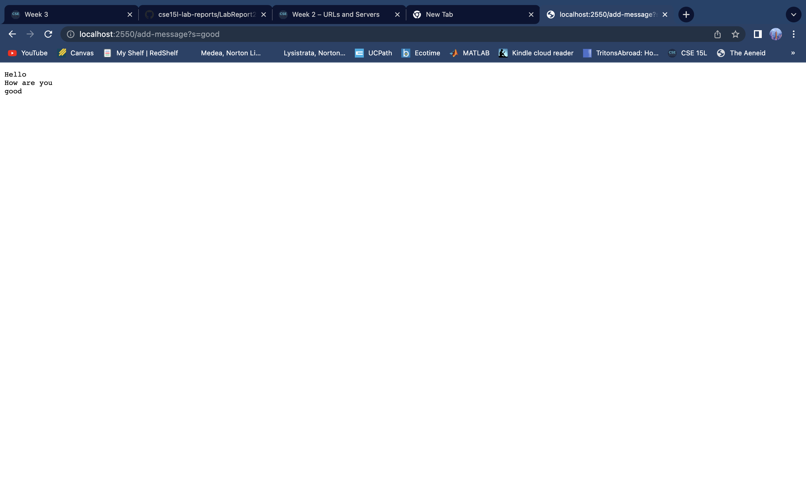
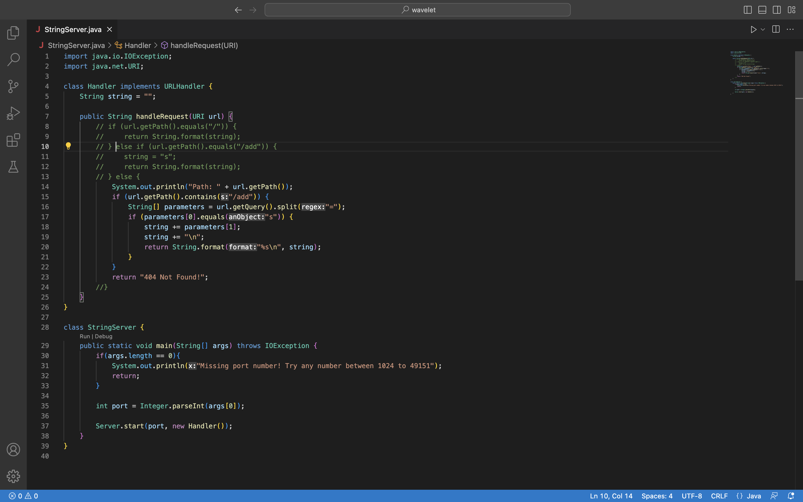
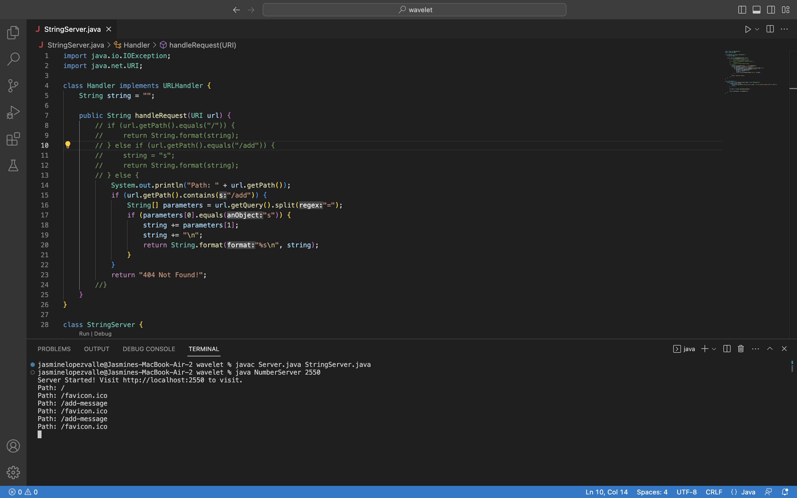

# Lab Report 2

## Welcome to CSE15L

## Part 1

**ScreenShots of browser and Code**

- In the URL after the `=` type in `Hello` and the press eneter. The page will then display `Hello` as seen above.


- Next, delete the `Hello` and type in the URL `How%20are%20you` the `%20` acts as spaces as seen above. This will add both the previous and the current words in the webpage.


- Finally repeat by deleting the `How%20are%20you` and type in `good` to then press enter. As you can see, all the previous written text in the URL have shown. 


- This code was used for a previous task simialr to the current task done above. With some modifications we were able to use Strings instead of Numbers. The commented out section of the code is shown to not be used as it was for Numbers.
- This section of the code stayed almost exaclty the same with the change of `class StringServer` in which it was previously `class NumberServer`


- These are the commands used in the terminal which promoted acces the webpage in which we did our exceirse in the begining of this report. By accessing the server and clikcing the link provided it redircted to the URL.

## Methods called in Code

The methods in my code that are called are url.getPath(). which is in my public String handleRequest(URI url) and my StringServer class. These portions of my code allows it to run succesfully in the terminal and open my web browser with the messages shown above. 

## Relevant arguments to those methods, and the values of any relevant fields of the class

The relevant arguments to those methods are the string, url, and parameters. These arguements allow for the proper path to be in place and have the correct output.

## Values of any relevant fields of the class change from this specific request

The way in which these values of the relevant fields of the class change from this specific request is because it is able to concatinate from the previos even though a new message is being written. The fields are able to do this as shown in the code above. Each portion implementing the proper url to then split at a certain area to then add on from before. 


## Part 2

Choose one of the bugs from lab 3.

The bug chosen from lab 3 is the `reverseInPlace` method with the `reversed()` method. In order to fix the bug from the `reverseInPlace()` method you need to create a new `temp` values to switch the array elemnts until it reaches the middle elemnt in the array. While as for the `reversed()` method the code was changeing the old array and did not `return` the new one. To fix it you need to reassign the value and make sure the correct array is being returned rather than the incorrect one.

## Part 3

In a couple of sentences, describe something you learned from lab in week 2 or 3 that you didn’t know before.

I didn't know any of the things we did in lab for week 2 or 3, it was my first time but even so, what i would like to discuss is doing the 
NumberServer in week 2. When doing looking over the code provided from the lab i tried really hard to understand how it worked and why it
works. After intputting the follwoing commands into the terminal such as: 

```
⤇ javac Server.java StringServer.java 
⤇ java NumberServer 2550
Server Started! Visit http://localhost:2550
```

I then opened up a browser in my computer and otyped the following `http://localhost:2550`. Ultimattely, I leanred how to run a server 
which was really cool and super fun to do. It made me feel really smart :)


