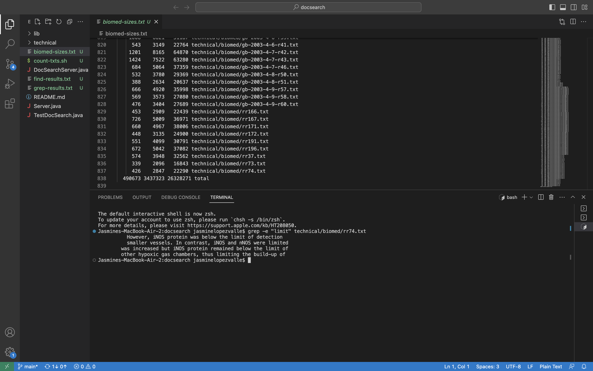
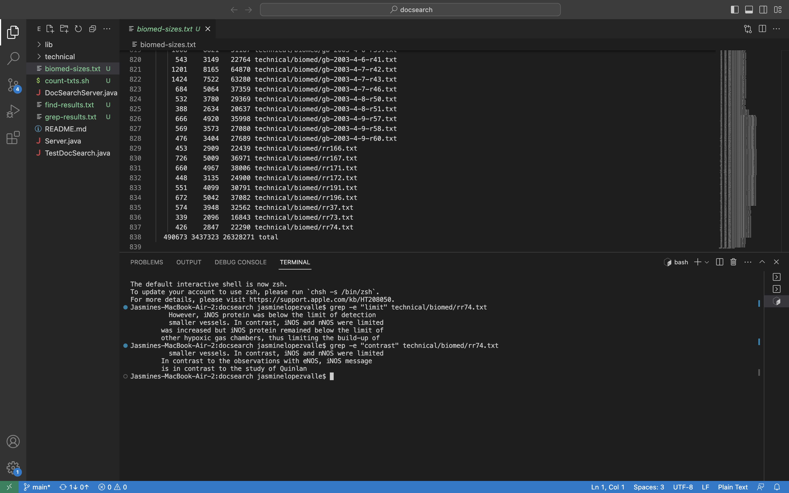
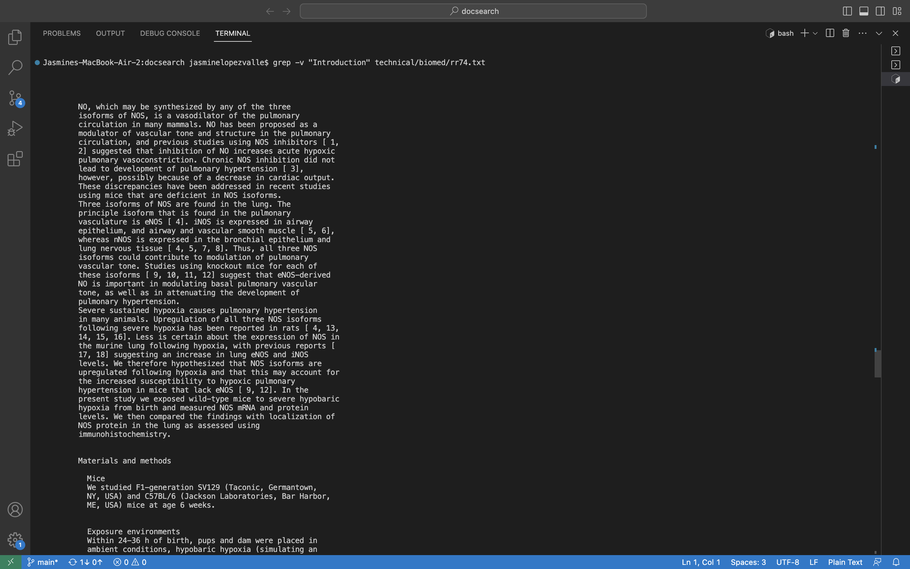
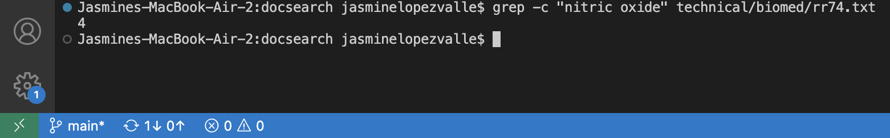
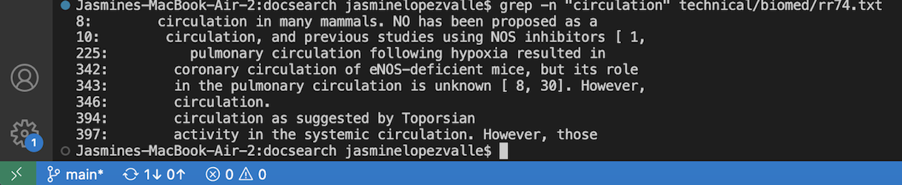
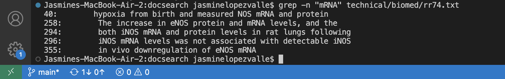

# Lab Report 3

## Researching Commands for `grep`

**1. `grep -e`**  
 

What it does : `grep -e` specifically prints one or more types of patterns that are seperated by newlines. 

  * Example 1: 
      
  * Example 2:
      

**2. `grep -v`**   

What it does : `grep -v` prints out all the lines in the pattern that are not the same (**DO NOT MATCH**).

  * Example 1: 
      
  * Example 2:
      

**3. `grep -c`**  

What it does : `grep -c` specifically prints out only the lines of the count that match that pattern.

  * Example 1: 
      
      
  * Example 2:
      

**4. `grep -n`**  

What it does : `grep -n` prints out the matching lines and their matching line numbers.

  * Example 1: 
      
      
  * Example 2:
      

## How were these commands found?

When trying to find the differnt commands that can be used with `grep` you can do a web search or you can ask 
the built-in command function on your terminal. In your terminal you type `man grep` which `man` is short for
"manual". This `man grep` command will allow you to see all the information about that specific command. This 
is where we were able to find the follwoing different ways to use `grep` command. Examples : `grep -e`, 
`grep -v`, `grep -c`, and `grep -n`, are a few of the many to use from!
